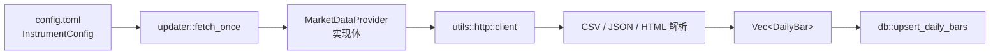

# Provider 架构设计

## 模块结构

```
providers/mod.rs
├── ProviderErrorKind     错误分类枚举
├── ProviderError         结构化错误，实现 std::error::Error
└── MarketDataProvider    async trait，唯一对外抽象

providers/{stooq,eastmoney,alpha_vantage}.rs
└── 各 Provider 结构体 + trait 实现 + 符号解析 + 响应解析
```

## 数据流



## MarketDataProvider 接口

定义于 `src/providers/mod.rs`：

| 方法 | 说明 |
|------|------|
| `name()` | 返回静态标识符，如 `"stooq"` |
| `fetch_daily_bars(instrument, start, end)` | 拉取 `[start, end]` 闭区间内的日线数据 |

**约定：**

- 返回的 bars 按 `trade_date` 升序排列（各实现内部保证）。
- 日期过滤：Stooq / Eastmoney 在 API 层指定范围；Alpha Vantage 在客户端 `retain` 过滤。
- 失败时使用 `ProviderError` 而非裸 `anyhow` 字符串，便于分类与落库。

## 错误模型

### ProviderErrorKind

| 种类 | 标识符 | 典型场景 |
|------|--------|----------|
| `Http` | `http` | 网络超时、非 2xx 状态码 |
| `RateLimited` | `rate_limited` | Alpha Vantage `Note` / `Information` |
| `Auth` | `auth` | 缺少 API Key |
| `NoData` | `no_data` | 空响应、无 klines、日期范围内无数据 |
| `MalformedResponse` | `malformed_response` | JSON/CSV 格式错误、字段缺失 |
| `UnsupportedInstrument` | `unsupported_instrument` | 无法解析 symbol/secid、provider 被禁用 |
| `ProviderMessage` | `provider_message` | 上游明确错误消息 |

### ProviderError 结构

```rust
pub struct ProviderError {
    pub provider: &'static str,
    pub kind: ProviderErrorKind,
    pub raw_message: String,
}
```

实现 `Display` 与 `std::error::Error`，可被 `anyhow` 包装。调用方通过 `downcast_ref::<ProviderError>()` 提取结构化信息。

### 错误落库

`services/provider_errors.rs` 提供两个入口：

- `record_provider_error` — 从 `Error` 中提取 `ProviderError` 或降级为 `ProviderMessage`
- `record_empty_response` — 专门记录 `NoData` 类空响应

写入 SQLite `provider_errors` 表，字段包括 `provider`、`instrument_id`、`error_start`、`error_end`、`kind`、`raw_message`、`created_at`。

## HTTP 客户端

`src/utils/http.rs` 提供共享 `reqwest::Client`：

- 超时：30 秒
- User-Agent：`marketfeed-rs/0.1`
- TLS：`rustls`（reqwest default-features 关闭）

各 Provider 在 `new()` 时持有该 client 实例，避免重复构建。

## 解析层分工

| 数据源 | 响应格式 | 解析位置 |
|--------|----------|----------|
| Stooq | CSV | `utils/csv::parse_stooq_daily` |
| Alpha Vantage | JSON 或 CSV | `alpha_vantage.rs` + `utils/csv::parse_alpha_vantage_csv_daily` |
| Eastmoney 股票 | JSON | `eastmoney.rs::parse_eastmoney_daily` |
| Eastmoney 基金 | JS（`Data_netWorthTrend`） | `eastmoney.rs::parse_eastmoney_fund_nav` |

## Provider 工厂

`updater::fetch_once` 是唯一实例化入口，按名称分支：

```rust
match provider_name {
    "stooq" if config.providers.stooq_enabled => StooqProvider::new(...).fetch_daily_bars(...),
    "alpha_vantage" if config.providers.alpha_vantage_enabled => AlphaVantageProvider::new(...).fetch_daily_bars(...),
    "eastmoney" if config.providers.eastmoney_enabled => EastmoneyProvider::new(...).fetch_daily_bars(...),
    "stooq" | "alpha_vantage" | "eastmoney" => Err(/* disabled */),
    other => Err(/* unknown */),
}
```

Provider 被禁用时返回 `UnsupportedInstrument`，而非静默跳过。

## 重试机制

`updater::fetch_with_retries` 对每次 fetch 最多重试 `config.update.retry_count` 次（默认 2），间隔 `retry_delay_ms`（默认 1000ms）。仅对 transient 失败有效；结构化错误（如 Auth、UnsupportedInstrument）重试不会改善结果。
