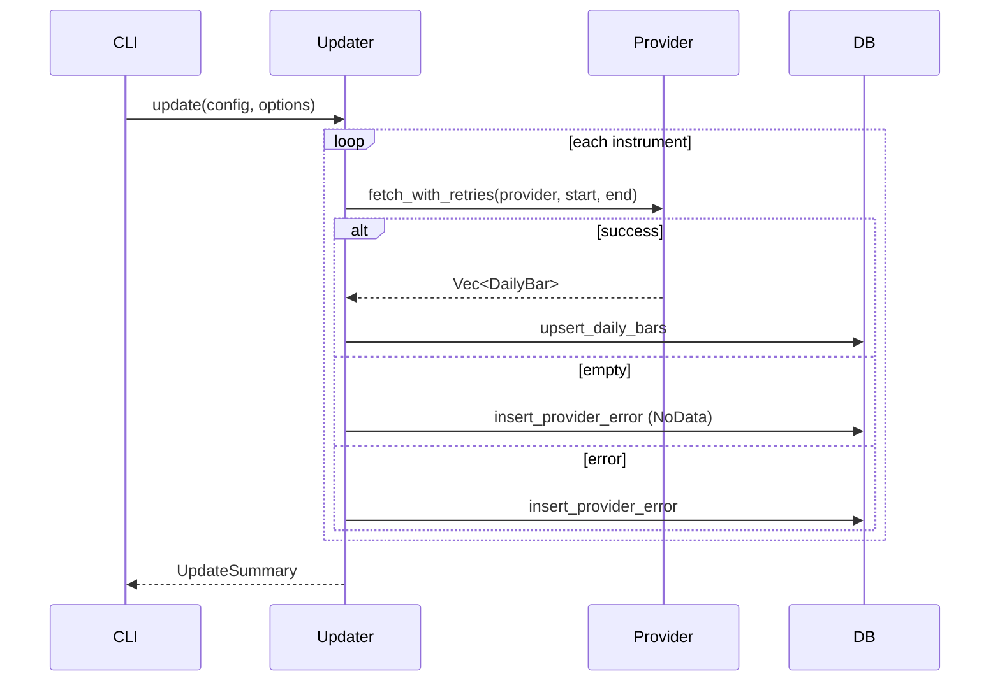
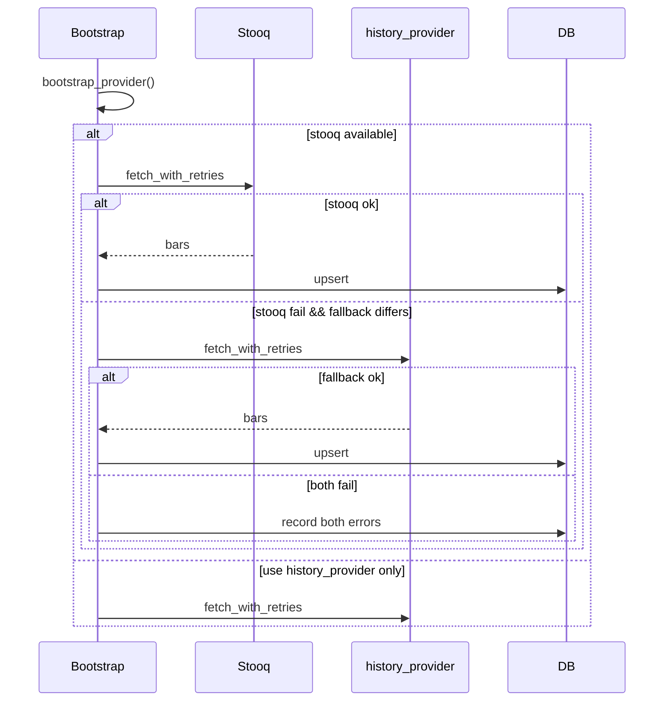

# Provider 集成与调用流程

## 调度入口

Provider 不直接被 CLI 调用，而是通过 `services/updater.rs` 统一调度：

```
cli::run
  ├── Bootstrap  → bootstrap::bootstrap_with_options
  ├── Update     → updater::update
  └── RunDaily   → updater::update_recent → signal → report
```

核心函数链：

```
fetch_with_retries(config, instrument, provider_name, start, end)
  └── fetch_once(...)           // 按名称实例化 Provider
        └── MarketDataProvider::fetch_daily_bars(...)
```

## 增量更新（Update）

**入口：** `updater::update` / `update_recent`

**Provider 选择：** 始终使用 `instrument.daily_provider()`，当前实现等同于 `instrument.provider`。

**日期范围：**

- `end` = 参数 `to` 或今日 UTC
- `start` = 参数 `from` 或 `end - default_lookback_days`（默认 7 天）

**流程：**

```
for each instrument:
  fetch_with_retries(instrument.provider, start, end)
    Ok(bars) → db.upsert_daily_bars
    Ok(empty) → record_empty_response (NoData)
    Err → record_provider_error
```

单个 instrument 失败不影响其他 instrument 继续更新。

## 历史初始化（Bootstrap）

**入口：** `bootstrap::bootstrap_with_options`

**Provider 选择：** `bootstrap_provider(config, instrument)`：

```
if stooq_enabled && resolve_stooq_symbol(instrument).is_some()
    → "stooq"
else
    → instrument.history_provider()
```

**日期范围：**

- `end` = 今日 UTC
- `start` = 参数 `from` 或 `end - max_bootstrap_days`（默认 5000 天）
- 若 DB 已有更早数据，则 `fetch_end = earliest_existing - 1 天`（只补缺口）

**Fallback 策略：**

当 bootstrap provider ≠ history provider 且主 provider 失败时：

```
try fetch_with_retries(bootstrap_provider)
  Err → try fetch_with_retries(history_provider)
    Ok → upsert
    Err → 记录两个 provider 的错误
```

仅 primary ≠ fallback 时触发；两者相同时直接记录错误。

## 每日流水线（RunDaily）

```
1. updater::update_recent     # 默认回溯 7 天
2. signal::calculate_and_store
3. report::write_markdown_report_for_date
```

Provider 错误不会导致非零退出码；错误写入 DB 并在报告中展示。

## 数据落库

成功 fetch 后调用 `db::upsert_daily_bars`：

- 表：`daily_bars`
- 唯一约束：`(instrument_id, trade_date)`
- 冲突时覆盖（INSERT OR REPLACE 语义）

`DailyBar.source` 字段记录实际 provider 名称（如 `eastmoney_fund` 用于基金分支）。

## 错误落库与报告

`provider_errors` 表记录失败详情，日报通过 `db::provider_errors_since` 拉取当日错误。

`UpdateSummary::provider_error_count()` 统计失败 instrument 数量，供 CLI 输出提示。

## Dry Run

`--dry-run` 模式下：

- Bootstrap / Update 不发起 HTTP 请求
- 不写入 `daily_bars` 或 `provider_errors`
- 输出 planned provider 与日期范围

RunDaily dry-run 额外跳过 signal 与 report 写入。

## 时序图

### 增量更新



### Bootstrap（含 Fallback）



## 扩展新 Provider

1. 在 `src/providers/` 新增模块，实现 `MarketDataProvider`
2. 在 `providers/mod.rs` 中 `pub mod` 导出
3. 在 `config.rs` 添加配置结构与校验
4. 在 `updater::fetch_once` 添加分支
5. 在 `config.example.toml` 补充示例
6. 更新本文档
